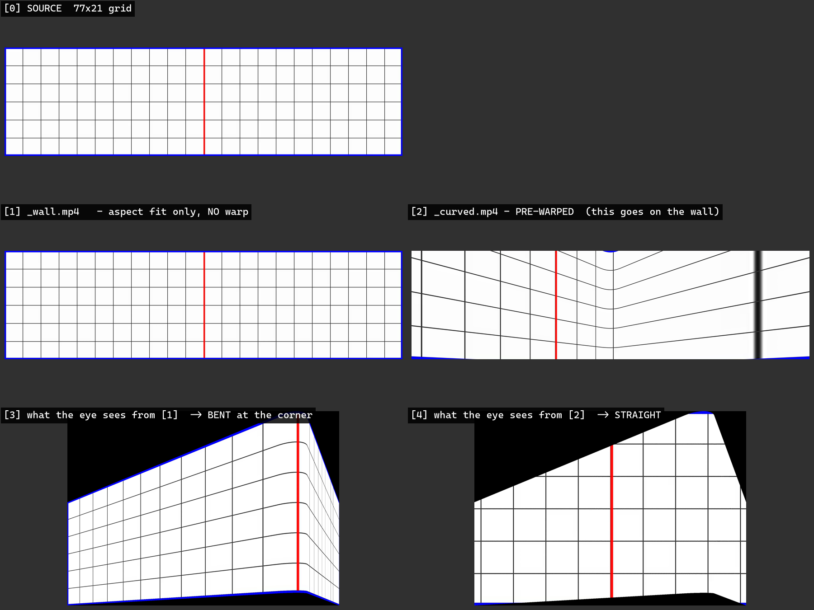

# 쉬운 설명서

이 프로젝트가 뭘 하는 건지, 뭘 만지면 뭐가 바뀌는지, 문제가 생기면 어디를 보는지.
기술적인 세부와 수치는 `00-overview.md`, 남은 일은 `01-todo.md`.

최종 갱신 2026-08-25.

---

## 1. 한 줄 요약

**특정 위치에 선 사람의 눈에만 착시가 맞게 보이도록, 꺾인 LED 벽에 나갈 영상을 미리 찌그러뜨린다.**

코엑스 파도(SM타운 앞 전광판)와 같은 원리다.

```
        벽 (위에서 본 그림, 90도로 꺾임)

              ┌──────────┐
             ╱            ╲
            ╱              ╲       <- 실제 LED 벽. 물리적으로 꺾여 있다
           ╱                ╲
          ╱                  ╲

                   ●
              스위트스팟
        여기 선 사람 눈에만 정확하다
```

벽은 꺾여 있는데 영상은 평평한 사각형 파일이다. 그냥 틀면 코너에서 그림이 접혀 보인다.
그래서 **미리 반대로 찌그러뜨린 영상**을 만들어 벽에 넣는다. 그러면 스위트스팟에서
볼 때 원래 그림으로 펴져 보이고, 화면이 공간을 뚫고 나오는 것처럼 보인다.

---

## 2. 부품 3개

| | 무엇 | 언제 쓰나 |
|---|---|---|
| `Scripts/anamorphic.py` | 데스크톱 모니터 2대를 코너로 세운 소형 리그 | 자리에서 원리를 확인할 때 |
| `Scripts/flat.py` | 평면 77 x 21 m 벽 | 꺾이지 않은 벽 |
| `Scripts/curved.py` | **꺾인 코너 벽 (본편)** | 실제 현장 |
| `Scripts/convert_video.py` | 받은 영상을 벽에 맞게 변환 | 영상 납품될 때마다 |

세 리그는 서로 독립이다. 하나를 고쳐도 다른 둘은 안 바뀐다.

---

## 3. 값을 바꾸면 뭘 다시 돌려야 하나

이게 제일 자주 헷갈리는 부분이다. **두 갈래뿐이다.**

```
경로 A  (빠름, 10초)          경로 B  (느림, 1분)
────────────────────          ──────────────────────
python Scripts/curved.py      python Scripts/curved.py
        ↓                             ↓
Run_Curved.bat                Rebuild_Curved.bat     <- 여기가 추가
                                      ↓
                              Run_Curved.bat
```

**경로 A** = 창 크기, 화면 메시지 끄기 같은 "설정만" 바뀌는 값.

**경로 B** = 벽의 모양/위치가 바뀌는 값. 워프 메시를 다시 구워야 한다.

| 이 값을 바꿨다면 | 경로 |
|---|---|
| `RES_W`, `WIN_X/Y`, `HIDE_SCREEN_MESSAGES`, `FOLLOW_PLAYER` | A |
| `DEVELOPED_W_CM`, `SCREEN_H_CM`, `BEND_DEG`, `FILLET_R_CM`, `CONVEX` | **B** |
| `EYE_DIST_CM`, `EYE_HEIGHT_CM`, `SCREEN_BASE_CM`, `EYE_OFFSET_Y_CM` | **B** |
| `VIDEO`, `DEMO`, `VIDEO_PASSTHROUGH` | **B** |

> 헷갈리면 그냥 **경로 B**로 하면 된다. 1분 더 걸릴 뿐 틀리지 않는다.

### 중요: 재빌드 전에 언리얼 에디터를 끌 것

에디터가 켜져 있으면 파일이 잠겨서 **저장에 실패한다.** 그런데 예전에는 화면에 `done.`만
찍혀서 성공한 줄 알기 쉬웠다. 지금은 이렇게 나온다.

```
[실패] 빌드가 에러로 끝났습니다. Saved\Logs 의 최신 로그를 확인하세요.
        가장 흔한 원인: 언리얼 에디터가 켜져 있어 .uasset/.umap 이 잠김.
```

---

## 4. 벽 모양을 정하는 값들

`Scripts/curved.py` 위쪽에 다 모여 있다.

```
                     평면도                              측면도

          ←────── 전개 7700 cm ──────→              ┌─────┐  ↑
                                                    │     │  │ SCREEN_H_CM
        ╲                          ╱                │  벽 │  │   2100
         ╲                        ╱                 │     │  ↓
          ╲        ●C            ╱                  └─────┘  ↑ SCREEN_BASE_CM
           ╲   ╱‾‾‾‾‾╲          ╱                       ▲    ↓   (바닥에서 벽 하단)
            ╲╱  R=250 ╲       ╱                         │
             ╲_________╱                            ────┴──── 바닥
                  ↑
              필렛 (둥글게 꺾인 부분)             👁 EYE_HEIGHT_CM = 160

                  │
                  │ EYE_DIST_CM = 3500
                  │
                  👁 ←─ EYE_OFFSET_Y_CM ─→
              스위트스팟          (좌우로 벗어난 거리)
```

| 값 | 뜻 | 기본 |
|---|---|---|
| `DEVELOPED_W_CM` | 벽을 쫙 펴서 잰 **총길이** (면 + 호 + 면) | 7700 |
| `SCREEN_H_CM` | 벽 높이 | 2100 |
| `BEND_DEG` | 평면도에서 꺾이는 각 | 90 |
| `FILLET_R_CM` | 꺾이는 부분의 둥근 반지름 (지름 5 m) | 250 |
| `CONVEX` | `True` = 코너가 관람자 쪽으로 튀어나옴 | True |
| `EYE_DIST_CM` | 눈에서 코너 정점까지, **대칭축 방향** 거리 | 3500 |
| `EYE_HEIGHT_CM` | 바닥에서 눈높이 | 160 |
| `SCREEN_BASE_CM` | 바닥에서 **벽 하단**까지. 건물에 매달렸으면 500 | 0 |
| `EYE_OFFSET_Y_CM` | 스위트스팟이 좌우 대칭축에서 벗어난 거리 | 0 |

### 용어 주의: "라운드"

이 프로젝트에서 라운드는 **벽이 꺾이는 부분이 둥글다**는 뜻이다.
화면 네 모서리를 둥글게 깎는다는 뜻이 아니다. 예전 코드가 그걸 잘못 구현해서
`_deprecated/` 로 치웠다.

---

## 5. 스위트스팟이 정면이 아닐 때

관람 공간 문제로 대칭축 위에 설 수 없으면 `EYE_OFFSET_Y_CM` 을 음수(왼쪽) 또는
양수(오른쪽)로 준다. 벽은 그대로 두고 **눈만 옮기는** 방식이라 다른 값은 안 건드려도 된다.

다만 공짜가 아니다. 왼쪽으로 옮겨 가며 실측한 값:

| 옮긴 거리 | 먼 쪽 끝 입사각 | 양 끝 성김 | 판정 |
|---|---|---|---|
| 0 | 20.9° | 2.5배 | 이상적 |
| 5 m | 17.1° | 3.0배 | 좋음 |
| 10 m | 13.6° | 3.7배 | **실용 한계** |
| 15 m | 10.3° | 4.7배 | 먼 끝 화질 나쁨 |
| 20 m | 7.3° | 6.3배 | 거의 스침 |
| 35 m | — | — | **거부됨** (면이 접힘) |

- **입사각**: 벽을 얼마나 정면으로 보는가. 90°가 정면, 0°가 완전히 스침.
  20° 아래로 떨어지면 그쪽 끝은 픽셀이 가로로 뭉개진다.
- **성김**: 양 끝 화소가 정점 대비 몇 배로 늘어나는지. 그만큼 해상도가 깎인다.
- 35 m 에서 자체 점검이 막는 건 버그가 아니다. 눈이 벽면의 평면을 넘어가서
  그 면이 물리적으로 접혀 보이는, 표현 불가능한 배치다.

---

## 6. 영상 변환

```
python Scripts\convert_video.py 원본.mp4              -> Content\Movies\원본_wall.mp4
python Scripts\convert_video.py 원본.mp4 --curved     -> Content\Movies\원본_curved.mp4
python Scripts\convert_video.py 전개본.mp4 --preview  -> Content\Movies\전개본_eye.mp4
python Scripts\convert_video.py                       -> 자체 점검만
```

### `_wall` 과 `_curved` 의 차이 (제일 중요)

격자로 직접 만들어 본 결과다. 빨간 세로선이 **벽의 코너 위치**다.



| | `_wall.mp4` | `_curved.mp4` |
|---|---|---|
| **하는 일** | 비율만 77:21 로 맞춤 (레터박스/크롭) | 벽 형상 + 스위트스팟 위치를 계산해 **역왜곡** |
| **파일 자체 모습** | 원본과 거의 같음 [1] | 심하게 찌그러져 보임 [2] |
| **벽에 걸고 스위트스팟에서 보면** | 코너에서 **꺾여 보임** [3] | **곧게 펴짐** [4] <- 착시 성립 |
| **`EYE_DIST` / `EYE_OFFSET_Y` / `FILLET_R` 영향** | 없음. 비율만 봄 | 전부 받음 |
| **용도** | 벽지, 반복 패턴처럼 꺾여도 상관없는 것 | **본편.** 코엑스 파도 효과 |

- **[1] -> [3]**: 파일은 멀쩡한데 눈으로 보면 빨간 선에서 그림이 접힌다. 건물 모서리처럼
  보인다. 착시가 아니라 그냥 "꺾인 벽에 붙은 그림"이다.
- **[2] -> [4]**: 파일은 괴상하게 찌그러져 있는데 눈으로 보면 격자가 곧게 펴진다.
  벽이 꺾인 게 사라지고 하나의 평평한 창처럼 보인다.

즉 `_curved` 는 **벽의 꺾임을 미리 상쇄해 두는** 처리다. 벽이 오른쪽으로 꺾이면
영상을 왼쪽으로 꺾어 둔다.

### 셋의 관계

```
원본 ──(--curved)──> _curved.mp4 ──[벽에 넣음]──> 눈: 곧게 펴짐   착시 성립
  │
  └──(기본)────────> _wall.mp4   ──[벽에 넣음]──> 눈: 코너에서 꺾임

              --preview 는 위 "눈:" 부분을 파일로 뽑아 주는 시뮬레이터.
              벽에 넣는 파일이 아니라, 벽 없이 검증하는 용도다.
```

`--preview` 는 `--curved` 의 **역방향**이다. `_curved` 를 `--preview` 해서 원본 격자가
그대로 나오면 왕복이 맞는다는 증명이 된다.

### 검증하는 법

벽이 없어도 확인할 수 있다.

```
python Scripts\convert_video.py grid.mp4 --curved
python Scripts\convert_video.py Content\Movies\grid_curved.mp4 --preview
```

두 번째 결과가 **원본 격자와 똑같이 곧게** 나오면 맞는 것이다.
대조군으로 `_wall` 을 `--preview` 하면 건물 모서리처럼 확 꺾여 보인다.

### 리맵 캐시

변환 맵은 만드는 데 오래 걸려서 `%TEMP%\wallwarp_*.pgm` 에 캐시된다.
키는 `curved.py` 의 `geom_key()` 다.

> **형상 knob 을 새로 추가하면 반드시 `geom_key()` 에도 넣을 것.**
> 빠뜨리면 값을 바꿔도 낡은 맵이 조용히 재사용된다. 실제로 한 번 발생했다.

---

## 7. 오늘 겪은 문제와 해결 (실전)

### 무비 렌더 큐로 구웠는데 한쪽 파일이 텅 비었다

증상: `vp_left.mp4` 에 아무것도 없고 `vp_right.mp4` 에만 오브젝트가 나옴.

원인 두 가지가 겹쳐 있었다.

**(1) 코너 리그는 화면을 90도로 가르지 않는다.**

```
        vp_left        vp_right
       -24.5°..0°  |  0°..+24.5°
             \     |     /
              \    |    /
               \   |   /
                \  |  /
                 \ | /
                  \|/
                  👁  ──── 리그 정면 ───→
                                    .
                                     .  ← 대상이 전부 이쪽에 있으면
                                      .    vp_left 는 절반이 아니라 0
```

두 뷰포트는 **붙어서 49도 부채꼴 하나**를 만들고, 경계가 리그 정면(0도)이다.
리그 코 끝보다 왼쪽에 아무것도 없으면 왼쪽 파일은 완전히 빈다.

**(2) 레벨 시퀀스가 리그 위치를 덮어쓰고 있었다.**

`TestRenderMovie` 시퀀스가 `NDC_Anamorphic_2Mon` 을 붙잡고 Transform 트랙으로
위치를 애니메이션하고 있었다. 손으로 옮겨도 렌더할 때마다 날아갔다.

> **진단법: 디테일 패널에서 위치/회전/스케일 오른쪽의 주황 마름모를 본다.**
> 채워져 있으면 = 현재 열린 시퀀스에 그 프로퍼티의 키가 있다.
> 빈 회색 = 키 없음. `↩` 화살표는 기본값과 다르다는 뜻(별개).

해결: 시퀀서에서 Transform 트랙 삭제 → 리그를 대상 쪽으로 조준 → 저장 → 재렌더.
조준은 **뷰포트를 대상이 꽉 차게 놓고 액터 > 뷰에 오브젝트 스냅**이 제일 빠르다.

### 재빌드 배치를 돌렸는데 아무것도 안 바뀐다

거의 항상 **언리얼 에디터가 켜져 있어서 저장에 실패**한 것이다.
`Saved\Logs` 최신 로그에서 이걸 찾으면 된다.

```
LogSavePackage: Error: Error saving '.../Content/Curved/SM_WallCurved.uasset'
RuntimeError: Curved.umap 저장 실패 (다른 에디터에서 열려 있는지 확인)
```

성공하면 이렇게 나온다.

```
LogPython: warp mesh built: /Game/Curved/SM_WallCurved (41 columns)
LogPython: curved rig ready: DCRA at (0, 0, 160) = viewer's eye
```

### `EYE_OFFSET_Y_CM` 을 바꿨는데 실행 화면이 똑같다

**영상 전용 맵에서는 이게 정상이다.**

영상 플레이트는 워프 메시를 그대로 한 벌 더 쓰고 리그와 같은 위치에 놓인다.
즉 영상이 벽에 접착제로 붙어 있다. 눈이 옆으로 가면 **벽과 영상이 같이 움직인다.**
그래서 화면에 나가는 픽셀은 항상 원본 파일 1:1 그대로다.

```
눈 이동 → 벽 이동 → 영상도 같이 이동 → 출력 픽셀은 동일
```

오프셋이 실제로 먹는 곳은 셋이다.

| 어디 | 확인법 |
|---|---|
| `--curved` 사전 왜곡 | 변환된 파일을 비교하면 확실히 다르다 |
| 3D 콘텐츠 렌더 | `DEMO = True` 로 두면 프러스텀이 바뀐 게 보인다 |
| 에디터에서 벽 위치 | **가장 빠름.** 벽이 리그 정면에서 옆으로 밀려 있으면 적용된 것 |

### 벽이 통째로 까맣게 나온다

셋 중 하나다.

1. `VIDEO` 경로가 틀림 → 자체 점검이 잡아 준다
2. 영상 자체가 검정 → `MediaExample` 계열은 **평균 휘도 0.0 인 거의 완전 검정**이다.
   눈으로 볼 때는 반드시 `TestPattern` 계열을 쓸 것
3. 백페이스 컬링 → `FLIP_WINDING = True` 로 뒤집기

### 좌상단에 빨간 글씨가 뜬다

`StereoView: Primary ...` 는 nDisplay 를 켜면 항상 나오는 엔진 경고다. 리그 문제가 아니다.
각 스크립트의 `HIDE_SCREEN_MESSAGES = True` 로 끈다.

> 단, **온스크린 경고를 전부 끈다.** "Lighting needs to be rebuilt" 같은 진짜 경고도
> 같이 사라진다. 상영용은 `True`, 개발 중에는 `False` 가 안전하다.

---

## 8. 치트시트

```bat
rem ── 값 바꾼 뒤 (설정만) ────────────────────────────
python Scripts\curved.py
Run_Curved.bat

rem ── 값 바꾼 뒤 (벽 모양/위치) ── 에디터 반드시 끄고 ─
python Scripts\curved.py
Rebuild_Curved.bat
Run_Curved.bat

rem ── 영상 받았을 때 ────────────────────────────────
python Scripts\convert_video.py 원본.mp4 --curved
rem  -> curved.py 의 VIDEO 를 Content\Movies\원본_curved.mp4 로
Rebuild_Curved.bat
Run_Curved.bat

rem ── 착시가 맞는지 벽 없이 확인 ────────────────────
python Scripts\convert_video.py Content\Movies\원본_curved.mp4 --preview

rem ── 렌더 결과 좌우 합치기 ─────────────────────────
ffmpeg -i vp_left.mp4 -i vp_right.mp4 -filter_complex "[0:v][1:v]hstack" out.mp4
```

실행 조건: **디스플레이 배율 100%**, **작업표시줄 자동 숨김**.
둘 중 하나라도 어긋나면 창이 엉뚱한 모니터로 튀거나 크기가 안 맞는다.

---

## 9. 지금 파일 상태

작업/측정하느라 바꿔 둔 값이 있다. 실제 현장 값으로 되돌릴지 결정이 필요하다.

```python
# Scripts/curved.py
SCREEN_BASE_CM  = 500.0     # 건물 5 m 위 (현장 반영)
EYE_OFFSET_Y_CM = -1500.0   # 실험값. 실제 관람 위치 확정 후 조정
VIDEO = "Content/Movies/TestPattern_wall.mp4"   # 색 측정용. _curved 파일로 교체 필요
DEMO  = False
```

남은 일은 `01-todo.md` 참고.
